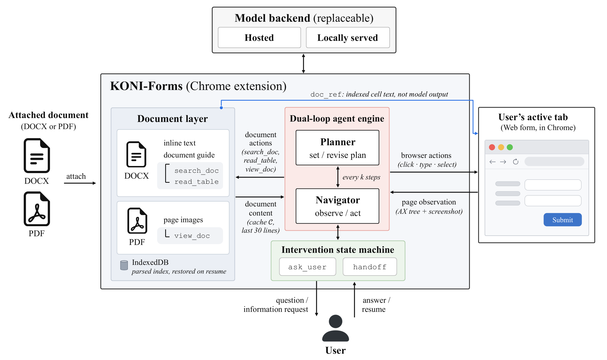

<p align="center">
  
</p>

<h1 align="center">KONI-Forms</h1>
<p align="center"><b>A browser agent that fills web forms from your documents — and asks you when the document is not enough.</b></p>

<p align="center">
  <a href="LICENSE"></a>
  
</p>

## ⚡ Install

1. Download `koni-forms-1.0.0.zip` from [**Releases**](https://github.com/Byun11/KONI-Forms/releases/latest) and unzip it.
2. Open `chrome://extensions`, turn on **Developer mode**, click **Load unpacked**, and select the unzipped folder.
3. Click the KONI icon, open **⚙ Settings → Models**, add your provider and API key, and pick a model for the Planner and the Navigator.
4. Open any web form, attach a DOCX or PDF with 📎, and tell it to fill the form.

A step-by-step guide with screenshots, model requirements, and troubleshooting is in the [release notes](https://github.com/Byun11/KONI-Forms/releases/latest).

## 🚀 What is KONI-Forms?

Filling a web form from a document is mostly transfer work: find the value, type it into the right field, repeat. KONI-Forms adds a **document layer** to a browser agent so it can work from the document instead of guessing, and a **user-intervention loop** so that a value the document does not settle becomes a question, not a fabrication.

<p align="center"></p>

### Key Features

* **Document-grounded filling** — search the document, read its tables, view PDF pages, and point a form field at the exact document cell it came from.
* **Asks instead of guessing** — when the document does not settle a value, the agent asks you and continues with your answer; when it cannot continue, it stops and says why.
* **You stay in control** — confirmation before irreversible actions (submitting forms, payments, sending messages), and optional plan approval before a run starts.
* **Your own API key** — OpenAI, Anthropic, Gemini, Groq, Cerebras, DeepSeek, Grok, OpenRouter, Azure OpenAI, Llama API, and OpenAI-compatible endpoints.

## 📊 Evaluation

The evaluation fills three public [OSWorld 2.0](https://github.com/Task-Web/OSWorld-web) web forms from documents and scores the saved form state against gold answers.

| Form | Site | Tasks | Field modes in gold |
|---|---|---|---|
| Expense claim | ExpenseFlow | `expense_01` – `expense_03` | AUTO, ASK_USER |
| Insurance claim | InsClaim | `insurance_01` – `insurance_03` | AUTO, ASK_USER, USER_ONLY, MUST_BE_EMPTY |
| Account registration | CloudCRM | `crm_01` – `crm_03` | AUTO, ASK_USER |

Each of the nine tasks comes at three document scales, and each scale as both DOCX and PDF — 27 variants in all:

| Suffix | Pages | Document |
|---|---|---|
| *(none)* | 1–2 | the original document |
| `x1` | 28–36 | the same document surrounded by policy text, filing guidance, and a specimen form carrying the same labels |
| `x2` | 44–57 | the same, with more of that surrounding material |

Target values and gold states are identical across the three scales: only document length and distractor content change, not the task. Page and word counts for every variant are in [`experiments/docs/_manifests/`](experiments/docs/_manifests).

Gold annotates **191 AUTO fields** (CRM 36, insurance 43, expense 112). Fields that must stay empty, expected user questions, and user-only steps are annotated separately and lie outside the 191. The scorer is a single standard-library Python file:

```python
import json, score
gold = json.load(open("gold/insurance_01.json", encoding="utf-8"))
score.CFG = score.DOMAINS[gold["domain"]]
print(score.score(state, gold, asked=[], on_page={}))   # state: the site's /api/state JSON
```

Site setup, the gold format, and the scoring rules are in [`experiments/README.md`](experiments/README.md).

## 🛠 Build from Source

Requires [Node.js](https://nodejs.org/) 22.12+ and [pnpm](https://pnpm.io/installation) 9.15.1.

```bash
git clone https://github.com/Byun11/KONI-Forms.git
cd KONI-Forms
pnpm install
pnpm build      # unpacked extension in dist/
pnpm zip        # zipped extension in dist-zip/
```

## 🏗 Repository Layout

* **`chrome-extension/`** – background service worker: planner/navigator agents, document tools, browser control.
* **`pages/`** – side panel (chat, document attach and parsing), options page, content script.
* **`packages/`** – shared storage, i18n, UI components, and build tooling.
* **`experiments/`** – documents, gold answers, OSWorld 2.0 site configs, and the scorer.

## 📜 License

Apache License 2.0 — see [LICENSE](LICENSE). Based on [Nanobrowser](https://github.com/nanobrowser/nanobrowser) (Apache-2.0).

Security issues: please use a [GitHub Security Advisory](https://github.com/Byun11/KONI-Forms/security/advisories/new).

---

<p align="center">Developed at <b>KISTI</b> (Korea Institute of Science and Technology Information).</p>
